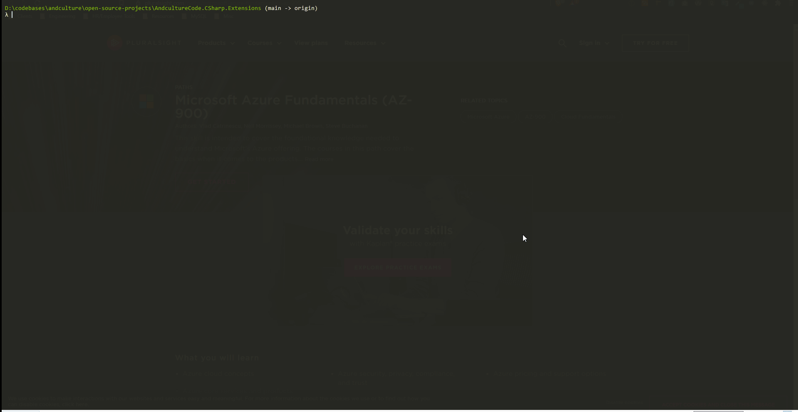

# How to contribute

One of the easiest ways to contribute is to participate in discussions on GitHub issues. You can also contribute by submitting pull requests with code changes.

### Pull Request Checklist

-   Provide a clear description of the problem accompanied by your solution
-   Descriptive comments
-   Read code and try your best to follow established code conventions (ie. format, regions, etc...)
-   Automated tests for new and/ or changed code paths
-   Ensure Travis CI build related to your branch is passing

### Merging and Versioning

While any and everyone is free to create pull requests per the checklist above, the process of merging and publishing versions is limited to core contributors established by andculture engineering leadership.

For andculture itself, project technical leads and architects will have access to merge and publish versions. Addition of external (non-andculture) employees from the community will be assessed and added as core contributors upon merit on an ongoing basis.

#### Setting up your fork

There are two ways to get your local development machine setup to contribute to AndcultureCode open source.

-   Automatically: Initiates forks of AndcultureCode respositories, clones them and configures them with a single command.
-   Manually: Follow standard configuration steps for forkings, cloning and configuring each repository one-by-one.

See instructions below for each respective strategy.

##### Automatically

The easiest way to get started contributing is to install the [AndcultureCode CLI](https://github.com/andculturecode/AndcultureCode.Cli) and use the `workspace` command.

1. Install `and-cli` globally (Version `>= 1.4.1`)

    ```sh
    npm install and-cli -g
    ```

2. Change directory to desired location on your system and run the workspace command

    ```sh
    cd ~
    and-cli workspace --clone --fork --usernames [YOUR_GITHUB_USERNAME]
    ```

3. Follow interactive prompts to configure github authentication, sit back and wait :)

4. Now, simply make changes to the desired project (ie. `[YOUR_GITHUB_USERNAME].AndcultureCode`), make changes and start submitting pull requests. Thank you for contributing!

##### Manually

Create a new fork on your own github account and clone that to your local development machine.


Add the source AndcultureCode repository as a new remote branch.

```bash
$: git remote add upstream git://github.com/AndcultureCode/AndcultureCode.{REPOSITORY_NAME}.git
$: git remote -v
```

From there you should regularly update `upstream/main` and merge into your branches

```bash
$: git fetch upstream
$: git checkout main
$: git merge upstream/main
```

Note: Check the specific repo to ensure that `main` is the default branch.



#### Submitting your work for review

First, run the appropriate build and test commands as well as perform a personal review of your work. Then you can create a new pull request for review by the team.

Navigate to your fork on github `https://github.com/{YOUR_USERNAME}/AndcultureCode.{REPOSITORY_NAME}/pulls` and click to create a new pull request.


### Dotnet Core Libraries

During development of dotnet core libraries, it might be necessary to test out your changes in a project without the need to publish a new version to nuget. Leveraging local nuget sources you can hook up your project to use your locally cloned source code.

1. Create a `NuGet.Config` file in your project's root directory
2. Add a new entry under the `<packageSources>` node that points to the absolute path of your desired library

    ```xml
    <?xml version="1.0" encoding="utf-8"?>
    <configuration>
      <packageSources>
        <add key="local-source" value="/c/path/to/my/repo/AndcultureCode.CSharp.Core/src/AndcultureCode.CSharp.Core/bin/Debug" /    >
        <add key="nuget.org" value="https://api.nuget.org/v3/index.json" protocolVersion="3" />
      </packageSources>
    </configuration>
    ```

3. If not already added, we recommend adding the `<GeneratePackageOnBuild>` option to your project's .csproj file. This will automatically generate a properly versioned nupkg on each dotnet build.

    ```xml
    <Project Sdk="Microsoft.NET.Sdk">
      <PropertyGroup>
        <GeneratePackageOnBuild>true</GeneratePackageOnBuild>
        <!-- Other properties (ie. Authors, Description, Version, etc...) -->
      </PropertyGroup>
    </Project>
    ```

    When you do a build, you should see `AndcultureCode.CSharp.Core.X.Y.Z.nupkg` added to your projects `bin/Debug` directory.

4. Finally perform a clean, restore and build of your project's source code and it should start using your local file system to provide the nuget package for this project.

    Note: If you find your updates are not being picked up, try increasing the version number of your package and updating that in your consuming project. Once Nuget gets a particular version in its local cache it doesn't always perform an update (unless you force a clean of your nuget cache [dotnet nuget locals command](https://docs.microsoft.com/en-us/dotnet/core/tools/dotnet-nuget-locals)).

## General feedback and discussions?

Start a discussion on the project's [repository issue tracker example](https://github.com/AndcultureCode/AndcultureCode.CSharp.Extensions/issues).

## Are you a core contributor preparing a release?

See our [release guide](RELEASES.md)
